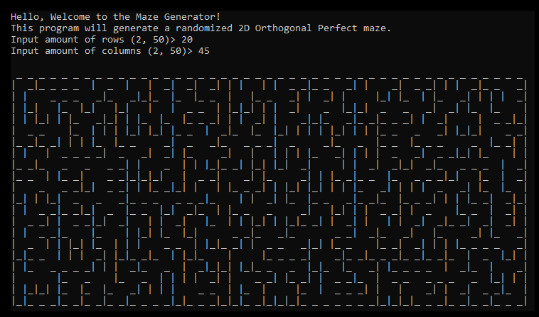

# Maze Generator
This project generates a 2D Orthogonal Perfect maze with a 
random distribution.

## Background
This project was written as part of an ongoing effort to take on different challenges
to teach how to program in modern C++. This, in part, is also a learning experience for me as I 
grew up with legacy C++, pointers and what not. Don't take my word as the *de facto* way of doing stuff.

Feel free to use the code or make it better by submitting pull requests. I'm always looking to be a better
programmer and engineer, and I hope these projects can help you too.

## Programming Topics
Standard library
- Random generator
- Pair / Tie
- Containers
    - vector
    - set
- Algorithms
    - shuffle
    - find
    - find_if
- Input / Output
    - Templates for typed input

## References
Based on C# Workshop from JWalsh. A blog entry with a copy of the initial project 
can be found [here](https://www.gamedev.net/blogs/entry/2255278-c-workshop-project-1-maze-generator/).

